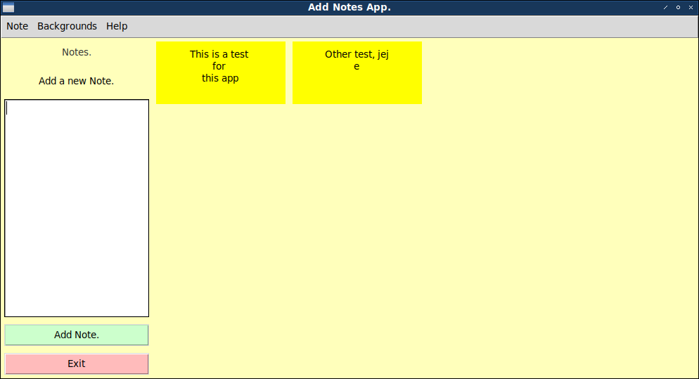

# Tkinter Notes App.

__This is a small application for add notes, simple and fast. Made with python-tkinter, and sqlite for save the notes.__


## Installation

__This project depend of tkinter !!, install executing:__

### Debian or Ubuntu GNU/Linux

```bash
sudo apt install python3-tk
```

### Windows

```bash
pip install python-tk
```

Referencies for install in Windows [https://stackoverflow.com/questions/20044559/how-to-pip-or-easy-install-tkinter-on-windows](https://stackoverflow.com/questions/20044559/how-to-pip-or-easy-install-tkinter-on-windows)

## Then

```bash
git clone https://github.com/EduardYan/tkinter-notes-app.git
cd tkinter-notes-app
python3 main.py
```

## Screenshot.
